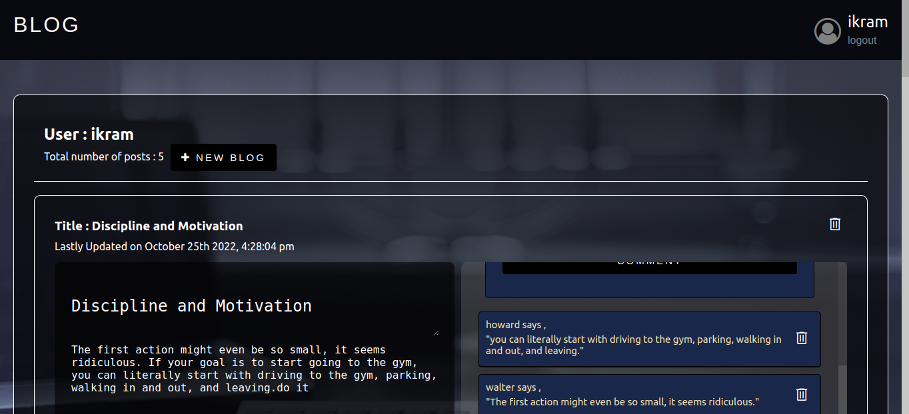

# Blog (Client)

<a href="https://ikram432k.github.io/blog-client-repo/" target="_blank" rel="noopener noreferrer">View the project here!</a> 👀

Blog API repo - <a href="https://github.com/Ikram432k/Project-Blog-API" target="_blank" rel="noopener noreferrer">click here!</a>

<h3>Summary</h3>

This project was made for <a href="https://www.theodinproject.com/paths/full-stack-javascript/courses/nodejs/lessons/blog-api" target="_blank" rel="noopener noreferrer">The Odin Project's</a> NodeJS curriculum. The goal of the project was to build a restful API that can be used to build a blog client and a blog CMS, it was made with the React JS Library, NodeJs, Express, and MongoDb.

 <h3>Technologies:</h3>
  <ul>
  <li>MongoDB</li>
  <li>Express</li>
  <li>ReactJS</li>
  <li>NodeJS</li>
  <li>PassportJS</li>
  <li>SASS</li>
 </ul>

 <h3>Notes & Features:</h3>
 <ul>
  <li>Responsive design</li>
  <li>Vistors dont need an account to leave a comment</li>
  <li>Passport Authentication using JSON web token for Admins</li>
  <li>MERN stack CRUD application</li>
 </ul>
 
<h3>Screenshots</h3>

<h4>Home screen</h4>

<h4>Post screen</h4>

<h4>Comments</h4>

<h4>Admin home page</h4>

---

<h3>Thanks for checking out my project! Any && all feedback is appreciated!</h3>